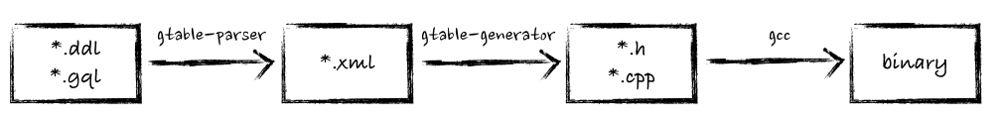

# what is gtable

gtable(GaloisTable) is a low-latency in-menory database engine implement by c++ for relational data storage especially for advertisement data. Support SQL like pre-compiled query language GQL. You can embed gtable into any c++ project.

# what is gtable-parser

gtable-parser is a tool for translating *.ddl or *.gql file inito xml file.


# install

Installation dependency:
* cmake 2.8+
* [cmake_setuptools](https://github.com/galois-advertising/cmake_setuptools)
* python 2.7+
* bison 2.3+
* flex 2.5+
* gcc c++17+

```
$ git clone --recursive git@github.com:galois-advertising/gtable-parser.git
$ cd gtable-parser
$ python setup.py install
```

If fails, check your gcc version:

```
$ export CC=/opt/gcc720/bin/gcc && export CXX=/opt/gcc720/bin/g++
```
and re-run the commands above.

# usage

```python
import os
import sys
import gqlparser

with open("schema/Datatable.ddl", 'r') as f: 
    datatable = f.read()
p = gqlparser.ddlparser()
xml = p.parse(datatable)
print xml

with open("schema/SeekIndex.gql", 'r') as f: 
    seekindex = f.read()
p = gqlparser.gqlparser()
xml = p.parse(seekindex)
print xml
```
